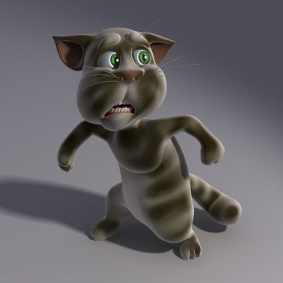

[License Button]: https://img.shields.io/badge/License-Apache_2.0-silver?logo=apache&logoColor=white
[License Link]: https://github.com/Andres9890/CAT-CARTOON.zip/blob/main/LICENSE 'Apache 2.0 License.'
[IA Button]: https://img.shields.io/badge/Archive.org_Page-black?logo=internetarchive&logoColor=white
[IA Link]:
https://archive.org/details/cat-cartoon.zip 'Archive.org Page.'
[Ts Button]: https://img.shields.io/badge/Original_Turbosquid_Page-orange?logo=turbosquid&logoColor=white
[Ts Link]:
https://web.archive.org/web/20090216180017/https://www.turbosquid.com/FullPreview/Index.cfm/ID/223226 'Original Turbosquid Page.'

# CAT CARTOON.zip
[![License Button]][License Link]
[![IA Button]][IA Link]
[![Ts Button]][Ts Link]

The unofficial git mirror of the CAT CARTOON.zip Turbosquid 3D model

## Credits:
Found by [addy1983 (Addy Gamer)](https://www.youtube.com/@addy1983) on one of his hard drives

Original model made by [Andrey Kravchenko](https://www.turbosquid.com/Search/Artists/Andrey-Kravchenko)

## What do i download?:
Note: the model is for 3dsmax only

[4.max](https://raw.githubusercontent.com/Andres9890/CAT-CARTOON.zip/refs/heads/main/Rigged/4.max): Rigged model
[Cat model without bones.max](https://raw.githubusercontent.com/Andres9890/CAT-CARTOON.zip/refs/heads/main/Non-rigged/Cat%20model%20without%20bones.max): Non-rigged model
[Textures](https://github.com/Andres9890/CAT-CARTOON.zip/tree/main/Textures): Textures
[Cat.zip](https://raw.githubusercontent.com/Andres9890/CAT-CARTOON.zip/refs/heads/main/Cat.zip): Full zip

## License:
The repo and it's content is licsensed under the [`Apache 2.0 License`](https://github.com/Andres9890/CAT-CARTOON.zip/blob/main/LICENSE)

>[!WARNING]
> In no way am I responsible for anything that happens/might happen when you use/distribute/edit this 3D model in any way, including, but not limited to, legal and copyright issues
